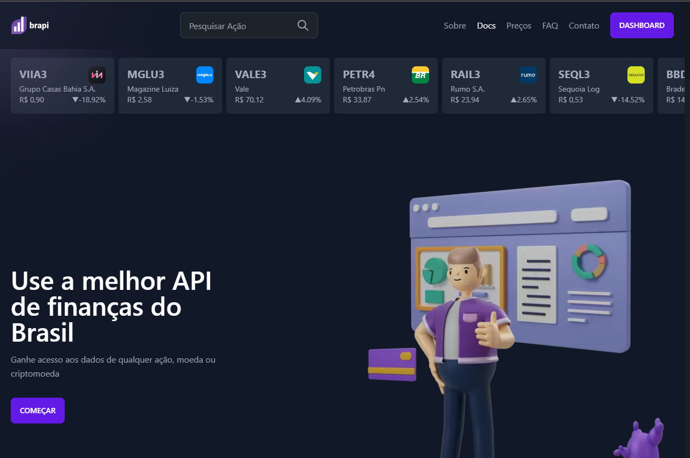
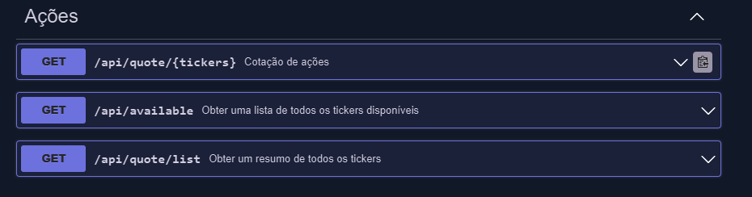
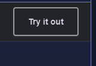
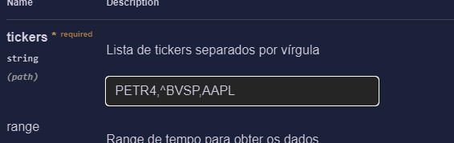
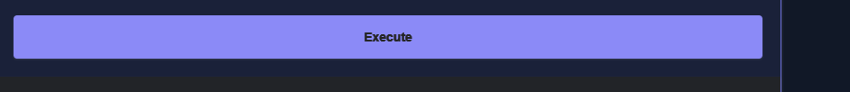
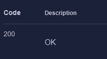
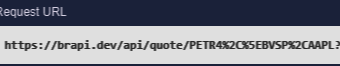

<h1 align="center">📈 Stonks-Consumindo API 📉<h1>

<h1 align="center">📎Acesse o site: <a href="https://stronkss.netlify.app/"> link<a>
<h1>

<h1>📌Objetivos<h1>

    ◻Consumir uma API
    ◻Responsividade
    ◻Consultar dados e apresentar ao usuário
    ◻Interface limpa e intuitiva
    ◻Gráfico
    

<h1 align="center">
    🌍API🌍
    
A api que utlizamos é o <a href="https://brapi.dev/">brapi</a>, a brapi é uma API open source que fornece dados do mercado financeiro, incluindo cotações de ações, criptomoedas, moedas e inflação. A API é gratuita para uso e não possui limitações em termos de uso.
    Veja a baixo um mini tutorial:
    

        
<h1>

<h2>
    1. No site da api, clique em docs no canto superior direito
     
    
<h2>

<h2>
      2. Em docs, escolha umas das três opções disponiveis para consulta
      
<h2>

<h2>
    3. Clique em try it out para obter o link experimental
      
<h2>
  
    
    
    
    

<h1 align="center">💻 TECNOLOGIAS UTILIZADAS:<h1>
    
<a href="https://html.com/">HTML5:</a> Linguagem de marcação para estruturar e apresentar o conteúdo do site.

    
<a href="https://www.css3.com/">CSS3:</a> Folhas de estilo para estilizar e melhorar a aparência do site.

    
<a href="https://www.javascript.com/">JavaScript:</a> Linguagem de programação para adicionar interatividade e funcionalidades avançadas ao site.

    
<a href="https://react.dev/">React js:</a> biblioteca JavaScript para criar interfaces de usuário. Possui componentes reutilizáveis que permite aos           desenvolvedores criar aplicativos web dinâmicos e interativos.
 
    
<a href="https://getbootstrap.com/">Bootstrap: </a> Biblioteca de componentes JavaScript para criar interfaces de usuário responsivas.

    
<a href="https://www.figma.com/">Figma:</a> Site para prototipação da aplicação web

    

